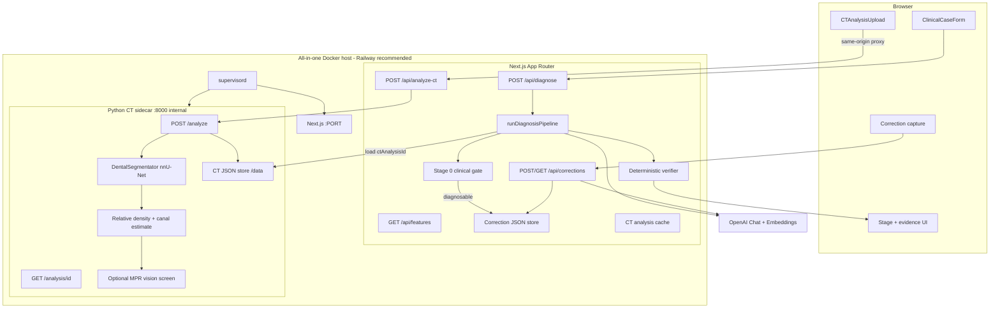
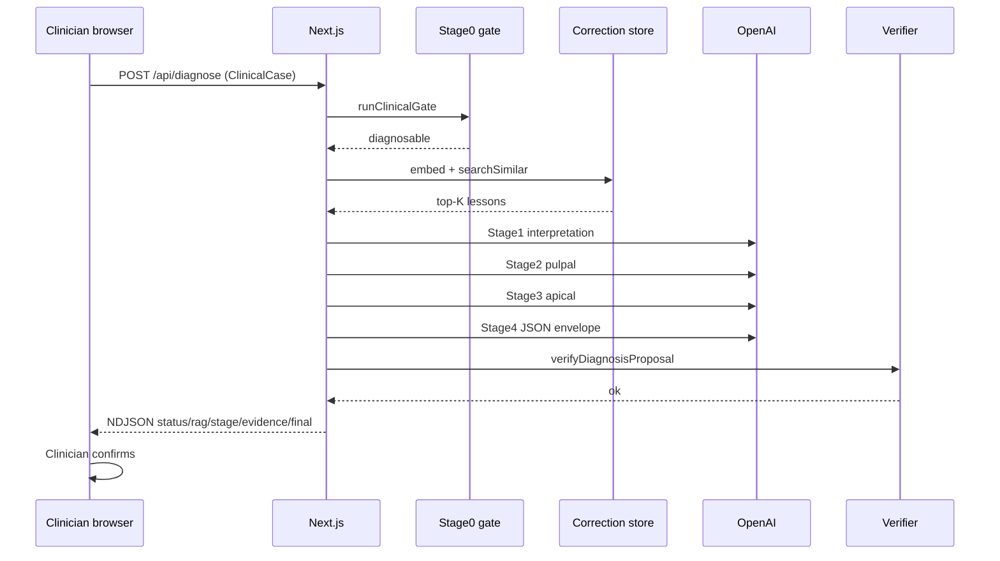

# Endodontic Diagnostic Agent — System Design

**Product:** Educational clinical decision-support web application that proposes AAE 2009 pulpal and apical diagnoses from structured findings, with optional correction memory and optional CBCT research support.

**Regulatory posture:** Educational / research decision support only. Not a certified medical device. Every output requires clinician confirmation. Do not use as a substitute for licensed clinical judgment.

**Taxonomy freeze:** `AAE_2009` (see `lib/schemas/clinical-case.ts`). Previously Treated / Previously Initiated Therapy teeth are **out of scope** for this release.

---

## 1. Goals and non-goals

### Goals

1. Accept a structured clinical case (sensibility tests, mechanical tests, imaging, symptoms, confounders).
2. Produce a versioned diagnostic **envelope** that can either assign AAE enums or **abstain**.
3. Reason in a multi-stage agentic pipeline so interpretation, pulpal, apical, and synthesis are separated.
4. Enforce hard clinical prerequisites with a **deterministic verifier** (LLM proposes; rules decide permissibility).
5. Optionally retrieve past clinician corrections (RAG) as soft priors.
6. Optionally accept CBCT/DICOM as **non-diagnostic research support**, never as an override of clinical logic.
7. Deploy as a **single public URL** (web + CT in one Docker host) so non-technical users only click a link.

### Non-goals

- Real-time EHR integration, multi-tenant auth, or certified clinical deployment.
- Treating CBCT gray values as calibrated Hounsfield units for diagnosis.
- Automatic tooth numbering from DentalSegmentator as clinical truth.
- Using canal-path estimates as electronic working length.
- Streaming provisional chain-of-thought diagnoses that could anchor clinicians.

---

## 2. High-level architecture



### Authority model

| Layer | Role |
|-------|------|
| Structured case + provenance | Source of truth for findings |
| Stage 0 gate | Scope, sufficiency, conflicts **before** LLM enums |
| LLM Stages 1–4 | Propose interpretation and candidate diagnoses |
| Deterministic verifier | Accept, reject, or force abstention — **never override evidence** |
| Clinician | Final confirmation required on every envelope |

---

## 3. Repository layout

| Path | Responsibility |
|------|----------------|
| `app/` | Next.js UI + API routes |
| `components/` | `ClinicalCaseForm`, `CTAnalysisUpload` |
| `lib/schemas/clinical-case.ts` | Zod taxonomy, case contract, diagnosis envelope |
| `lib/endodontic-agent/` | Pipeline + clinical verifier |
| `lib/prompts/` | Curriculum + stage system prompts |
| `lib/correction-rag/` | Canonical serialization + JSON vector store |
| `lib/ct-analysis/` | Sidecar client, remote helpers, CT store |
| `lib/llm/` | OpenAI chat + embedding client |
| `lib/features.ts` | Feature flags |
| `lib/batch/` | CSV extraction + batch diagnose |
| `ct-sidecar/` | FastAPI DICOM research processor |
| `deploy/` | supervisord + entrypoint for all-in-one image |
| `Dockerfile` | Single container: Next + CT |
| `SHARE.md` | One-link hosting instructions |

---

## 4. Clinical data contract

Defined in `lib/schemas/clinical-case.ts`.

### 4.1 Taxonomy

**Pulpal (exactly one when diagnosable):**

- Normal Pulp  
- Reversible Pulpitis  
- Symptomatic Irreversible Pulpitis  
- Asymptomatic Irreversible Pulpitis  
- Pulp Necrosis  

**Apical (exactly one when diagnosable):**

- Normal Apical Tissues  
- Symptomatic Apical Periodontitis  
- Asymptomatic Apical Periodontitis  
- Acute Apical Abscess  
- Chronic Apical Abscess  

**Diagnostic status:**

- `diagnosable` — enums populated  
- `insufficient_data` — enums null  
- `conflicting_data` — enums null  
- `out_of_scope` — enums null  

Enums are populated **only** when `status = diagnosable`.

### 4.2 Case object (`ClinicalCase`)

| Block | Contents |
|-------|----------|
| `tooth` | Universal number, optional FDI, dentition, apex maturity |
| `treatmentHistory` | untreated / previously_initiated / previously_obturated / regenerative / unknown |
| `symptoms` | spontaneous, nocturnal, postural, referred, thermal, heat, cold-relieves |
| `visual` | sinus tract (+ traced), swelling (+ severity, rapid onset), fluctuance, pus, fever, lymphadenopathy, caries/exposure, crown, crack, trauma |
| `clinical` | Cold (+ linger seconds, vs control, validity, repeated), EPT (+ vs control, validity, repeated), percussion/palpation/biting **severity**, Tooth Slooth, transillumination, fluorescent light |
| `periodontal` | isolated deep pocket, mobility, occlusion trauma |
| `imaging` | PARL, J-shaped RL, PDL widening, lamina dura, multiple PA views, resorption |
| `confounders` | recent anesthesia, calcification, poor isolation, generalized low responsiveness, recent trauma |
| `ctAnalysisId` | Opaque server id (optional) |
| `ctSupport` | Server-populated only — never trusted from the browser |
| `additionalNotes` | Free text (no PHI) |

### 4.3 Missing-data policy

Distinct values:

- `unknown`, `not_performed`, `unable_to_test`, `invalid`, `not_assessed`

**Never** silently convert missing findings to `absent`.

### 4.4 Structural vs sensibility tests

- **Cold / EPT** — pulp sensibility  
- **Tooth Slooth** — biting / crack  
- **Transillumination / fluorescent light** — structural / caries clues, not sensibility  

### 4.5 Output envelope (`FinalDiagnosis`)

```json
{
  "taxonomyVersion": "AAE_2009",
  "status": "diagnosable",
  "pulpalDiagnosis": "Pulp Necrosis",
  "apicalDiagnosis": "Asymptomatic Apical Periodontitis",
  "finalDiagnosisLine": "...",
  "evidenceFor": [{ "claim": "...", "source": "sensibility" }],
  "evidenceAgainst": [],
  "conflicts": [],
  "missingRequiredData": [],
  "recommendedNextTests": [],
  "biologicalJustification": "...",
  "warnings": [],
  "clinicianConfirmationRequired": true
}
```

Evidence `source` values: `history` | `visual` | `sensibility` | `mechanical` | `imaging` | `periodontal` | `confounder` | `ct_support` | `curriculum` | `verifier`.

---

## 5. Diagnosis pipeline (detailed)

Entry points:

- Streaming: `runDiagnosisPipeline` → `POST /api/diagnose` (NDJSON)
- Batch: `runDiagnosisOnce` → `scripts/batch-diagnose.mts`

### 5.1 Stage 0 — Clinical gate (`runClinicalGate`)

Runs **before** any LLM call that would assign enums.

**Out of scope immediately if:**

- `taxonomyVersion` ≠ `AAE_2009`
- `treatmentHistory` ≠ `untreated`
- `tooth.dentition` = `primary`

**Insufficient if missing:**

- At least one of Cold or EPT performed  
- Control-tooth comparison for sensibility  
- Percussion and palpation assessed  
- Clinician PARL assessment present/absent  
- At least one valid sensibility result  

**Conflicting / caution examples:**

- Cold− (and EPT− or EPT not performed) without controls or without repeated valid testing → cannot force necrosis  
- Negative sensibility + confounders (trauma, open apex, crown, calcification, anesthesia, poor isolation)  
- PARL present with responsive pulp tests → imaging alone cannot establish endodontic origin  
- Unreviewed CT candidate / failed CT quality gate → warnings only  

If status ≠ `diagnosable` → return `abstentionResult` and stop.

### 5.2 Correction RAG retrieval (optional)

If `ENABLE_CORRECTION_RAG` is enabled (default **on**):

1. Serialize case with `serializeCaseCanonical`
2. Embed with `EMBEDDING_MODEL` (default `text-embedding-3-small`)
3. Cosine search over JSON store (`lib/correction-rag/store.ts`)
4. Keep hits with score ≥ `RAG_MIN_SCORE` (default `0.78`), top `RAG_TOP_K` (default `5`)
5. Inject as soft priors into Stage 1 / Stage 4 prompts

Retrieved memories **cannot** override gate or verifier prerequisites.

### 5.3 Stage 1 — Test interpretation

Prompt: `stage1SystemPrompt` + curriculum.

- Restate Cold/EPT with controls, validity, confounders  
- Restate mechanical tests and clinician imaging  
- Note abscess prerequisites if relevant  
- **Do not** assign final enums  

Streamed as teaching text (`type: "stage", stage: 1`).

### 5.4 Stage 2 — Pulpal candidate

- Exactly one pulpal enum string as candidate  
- Uses symptoms, coronal etiology, Cold/EPT + controls  
- Does **not** use apical imaging as primary pulpal decider  
- Does **not** force necrosis from Cold−/EPT− alone  
- Does **not** use a single linger cutoff to separate SIP vs AIP  

### 5.5 Stage 3 — Apical candidate

- Exactly one apical enum string as candidate  
- Uses pulpal context + percussion/palpation/biting severity + visual abscess signs + clinician imaging  
- AAA requires rapid-onset swelling with pus/fluctuance signs  
- CAA requires sinus tract  

### 5.6 Stage 4 — Synthesis

- Returns Zod-validated `FinalDiagnosis` JSON  
- Retry once if schema validation fails  
- Merge Stage 0 evidence into the proposal  

### 5.7 Deterministic verifier (`verifyDiagnosisProposal`)

After Stage 4:

| Rule | Effect |
|------|--------|
| Gate not diagnosable but enums non-null | Reject |
| AAA without rapid swelling + purulence pattern | Reject → abstain |
| CAA without sinus tract | Reject → abstain |
| Necrosis without control comparison | Reject → abstain |
| Necrosis with active false-negative confounders and no repeated testing | Reject → abstain |
| Apical disease based only on CT candidate without clinical apical findings | Reject → abstain |

Verifier **rejects or abstains**; it does not invent a replacement diagnosis.

### 5.8 Stream protocol

NDJSON events from `/api/diagnose`:

| `type` | Payload |
|--------|---------|
| `status` | Progress message |
| `rag` | `matchCount`, `contextBlock` |
| `stage` | `stage` 1–4, `title`, `content` |
| `evidence` | supporting / against / conflicts / missing / next tests |
| `final` | `FinalDiagnosis` |
| `error` | message |

UI shows stages and evidence; it does not stream tentative enum guesses as truth before `final`.

---

## 6. Knowledge layer

| Asset | Path | Role |
|-------|------|------|
| Curriculum | `lib/prompts/curriculum.md` | Biology of tests, criteria, differentials, abstention rules |
| Stage prompts | `lib/prompts/agent-stages.ts` | Narrow role instructions per stage |
| Loader | `lib/prompts/load-curriculum.ts` | Reads curriculum at runtime (included in serverless traces) |

Curriculum explicitly:

- Treats Cold−/EPT− as a **candidate** necrosis pattern, not an automatic rule  
- Separates SIP vs AIP without a hard linger cutoff  
- Requires AAE abscess prerequisites  
- Treats CT as non-diagnostic  

---

## 7. Correction RAG design

### Purpose

Institutional “do not repeat this mistake” memory — **not** weight training.

### Stored document

Per correction:

- Case fingerprint (canonical serialization)  
- Agent status + pulpal/apical at time of correction  
- Adjudicated reference status + pulpal/apical  
- Free-text reasoning (required)  
- Error types (`invalid_test_interpretation`, `mimic`, `missing_prerequisite`, `taxonomy_error`, `scope_error`, `other`)  
- Specialist identity, taxonomy version, approval status  
- Embedding of combined document  

### Storage

- JSON file store with base64 float32 embeddings (`lib/correction-rag/store.ts`)  
- Default path: `data/corrections.json` (Docker: `/data/corrections.json`)  
- On Vercel: `/tmp` (ephemeral)  

### APIs

- `POST /api/corrections` — ingest + embed  
- `GET /api/corrections?limit=` — list/export  

### Limits

- Soft prior only  
- No PHI in free text  
- Approval status is recorded; retrieval currently does not hard-filter on approval (operator should treat as research memory)

---

## 8. CT / CBCT research module

### Design principles

1. Off unless `ENABLE_CT_MODULE=true` (on by default **inside** the all-in-one Docker image).  
2. Clinician must identify the tooth (seed). Automated connected-component numbering is **not** clinical truth.  
3. DentalSegmentator is pretrained bulk anatomy — not validated per-tooth/canal/lesion segmentation.  
4. No universal ≥25% attenuation threshold as a diagnostic rule.  
5. Relative drop is an observation for review.  
6. Canal length is an anatomical estimate only — not apex-locator working length.  
7. Vertucci screen is exploratory.  
8. Imaging/CT alone never establishes endodontic origin or forces apical enums.  
9. CBCT should be used only when clinically indicated.

### Sidecar endpoints (`ct-sidecar`)

| Endpoint | Role |
|----------|------|
| `GET /health` | Liveness |
| `POST /analyze` | DICOM/ZIP → `CTSupport` + persist |
| `GET /analysis/{id}` | Retrieve immutable result |

### Pipeline

1. Require clinician seed  
2. Load DICOM series (SimpleITK)  
3. Quality gates (size, spacing, modality)  
4. DentalSegmentator (optional; may return `partial`)  
5. Heuristic tooth isolation (experimental)  
6. Relative apical vs reference-shell attenuation  
7. Optional MPR → vision morphology screen  
8. Persist under `analysisId`  

### Non-diagnostic payload fields

`candidateLowAttenuationRegion`, `qualityGatePassed`, `candidateLocation`, `candidateVolumeMm3`, `relativeAttenuationDropPercent`, `artifactWarnings`, `morphologyNotes`, `vertucciScreen`, `canalLengthEstimateMm`, `clinicianReviewed`, `reviewRequired: true`.

### Browser ↔ sidecar upload modes

| Deployment | Upload path |
|------------|-------------|
| All-in-one Docker | Same-origin `POST /api/analyze-ct` → local sidecar `127.0.0.1:8000` |
| Split (Vercel + external sidecar) | Browser posts directly to public `CT_SIDECAR_URL/analyze` |

Diagnose never accepts client-forged CT metrics — only `ctAnalysisId`, loaded server-side.

---

## 9. LLM integration

| Concern | Implementation |
|---------|----------------|
| Provider | OpenAI-compatible (`lib/llm/openai-provider.ts`) |
| Chat model | `ENDO_MODEL` (default `gpt-4o`) |
| Embeddings | `EMBEDDING_MODEL` (default `text-embedding-3-small`) |
| Auth | Server-side `OPENAI_API_KEY` only |
| JSON | Chat with `responseFormatJson` + Zod validation |
| Temperature | Low (≈0.1–0.2) for structured stages |

Visitors never hold the API key; the host configures it on the server.

---

## 10. API surface

| Route | Method | Purpose |
|-------|--------|---------|
| `/api/features` | GET | Flags + public CT upload URL (also healthcheck) |
| `/api/diagnose` | POST | Stream diagnosis pipeline (`maxDuration` 300s) |
| `/api/corrections` | POST/GET | Correction RAG ingest/list |
| `/api/analyze-ct` | POST | Proxy DICOM to sidecar (`maxDuration` 1800s) |

All routes use Node.js runtime.

---

## 11. User experience flow

1. Open shared URL (no install).  
2. Complete structured case form (required findings for diagnosable status).  
3. Optionally upload DICOM/ZIP + confirm tooth seed.  
4. Click **Run**.  
5. Watch status → retrieved corrections → Stages 1–4 → evidence table → final envelope.  
6. Clinician confirms or submits a correction for RAG.  
7. Optional export of corrections JSON.  

UI copy emphasizes: taxonomy version, CT/RAG on|off, educational-only, clinician confirmation required.

---

## 12. Deployment architecture

### Recommended: all-in-one (one URL)

```text
Public HTTPS URL
        │
        ▼
┌───────────────────────────────┐
│  Docker container (Railway)   │
│  supervisord                  │
│   ├─ Next.js  :$PORT          │
│   └─ CT API   :8000 (loopback)│
│  /data  (optional volume)     │
└───────────────────────────────┘
        │
        ▼
     OpenAI API
```

- Image: root `Dockerfile`  
- Process manager: `deploy/supervisord.conf`  
- Config: `railway.json`  
- Local: `docker compose up --build` / `npm run app:up`  

Required host env: `OPENAI_API_KEY` (+ optional model overrides).

### Alternative: Vercel clinical-only

- Next.js only  
- `ENABLE_CT_MODULE=false`  
- Corrections store ephemeral on serverless  
- No in-process Python CT  

### Feature defaults

| Capability | Bare Node (unset) | All-in-one Docker |
|------------|-------------------|-------------------|
| Clinical multi-stage agent | On | On |
| Stage 0 + verifier | On | On |
| Correction RAG | On | On |
| CT module | Off | On |

---

## 13. Configuration reference

| Variable | Meaning |
|----------|---------|
| `OPENAI_API_KEY` | Required server secret |
| `ENDO_MODEL` | Chat model |
| `EMBEDDING_MODEL` | Embedding model |
| `OPENAI_BASE_URL` | Optional compatible base URL |
| `ENABLE_CORRECTION_RAG` | Correction memory (default on) |
| `RAG_TOP_K` | Neighbor count |
| `RAG_MIN_SCORE` | Similarity floor |
| `CORRECTIONS_JSON_PATH` | RAG store path |
| `ENABLE_CT_MODULE` | Show/allow CT |
| `CT_SIDECAR_URL` | Sidecar base URL |
| `CT_ANALYSIS_STORE_PATH` | CT result directory |
| `CT_VISION_MODEL` | Sidecar vision model |
| `CT_ASSUME_CALIBRATED_HU` | Treat values as HU (default false) |
| `CT_ANALYSIS_TIMEOUT_MS` | Proxy timeout |
| `CT_ALLOWED_ORIGINS` | Sidecar CORS (split deploy) |

---

## 14. Safety and clinical constraints (encoded)

1. **Abstention over forced labels** when data incomplete/conflicting/out of scope.  
2. **No Cold− + EPT− → automatic Pulp Necrosis.**  
3. **No universal CBCT % drop diagnostic override.**  
4. **AAA / CAA** require AAE clinical prerequisites, not percussion/CT alone.  
5. **Imaging alone** does not establish endodontic origin.  
6. **Control-tooth comparison** required for confident sensibility interpretation.  
7. **Missing ≠ absent.**  
8. **Clinician confirmation** always true on outputs.  
9. **No PHI** in notes, corrections, or logs (operator responsibility).  
10. **CT is research support**, feature-flagged, non-diagnostic.

---

## 15. Evaluation posture (intended protocol)

Not fully automated in-repo, but the design assumes:

- Freeze population + taxonomy (`AAE_2009`)  
- Compare rules-only vs single-call vs multi-stage  
- Measure per-class sensitivity/specificity, macro-F1, exact pulpal+apical pair accuracy, confusion matrices, high-consequence errors (false necrosis, missed abscess, anatomical mimics)  
- Keep CT and RAG off until they show independent benefit without worsening safety  
- Prospective silent-mode validation before clinician-facing display  

Batch tooling (`npm run batch`) supports offline case runs for evaluation sets.

---

## 16. Sequence — happy path (diagnosable clinical case)



### Sequence — CT then diagnose (all-in-one)

```mermaid
sequenceDiagram
  participant U as Browser
  participant N as Next.js
  participant C as CT sidecar

  U->>N: POST /api/analyze-ct (DICOM multipart)
  N->>C: POST /analyze
  C-->>N: CTSupport + analysisId
  N-->>U: analysisId + summary
  U->>N: POST /api/diagnose (includes ctAnalysisId)
  N->>C: GET /analysis/{id}
  C-->>N: CTSupport
  Note over N: CT is research context only; verifier blocks CT-only apical disease
  N-->>U: Final envelope
```

---

## 17. Component responsibilities (summary table)

| Component | Decides | Must not decide |
|-----------|---------|-----------------|
| Form / Zod schema | Shape of inputs | Diagnosis |
| Stage 0 gate | Scope / sufficiency / abstain | Final treatment |
| LLM stages | Candidate interpretation + enums | Hard prerequisite overrides |
| Verifier | Permit / reject / abstain | Silent rewrite without evidence |
| Correction RAG | Soft priors | Prerequisite overrides |
| CT sidecar | Candidate imaging features | Vitality, abscess type, endodontic origin |
| Clinician | Final acceptance | — |

---

## 18. Known limitations

- No built-in authentication / RBAC (share-link model).  
- Serverless correction/CT stores are ephemeral without a volume/DB.  
- DentalSegmentator weights may be absent → CT `partial`.  
- Long multi-stage runs can hit platform timeouts on restrictive free plans.  
- Free-text corrections can contain PHI if users ignore guidance.  
- Label “educational only” does not by itself determine FDA/CDS regulatory status for patient-specific outputs.

---

## 19. Related documents

| Doc | Audience |
|-----|----------|
| `SHARE.md` | Host: publish one public URL |
| `SETUP.md` | Local Node install for developers |
| `README.md` | Project overview |
| `BATCH.md` | CSV batch evaluation |
| `lib/prompts/curriculum.md` | Clinical teaching content for the agent |
| `ct-sidecar/README.md` | CT research module details |

---

*This document describes the system as implemented in the `endo1` repository. When behavior and docs diverge, trust the code paths named above and update this design accordingly.*
